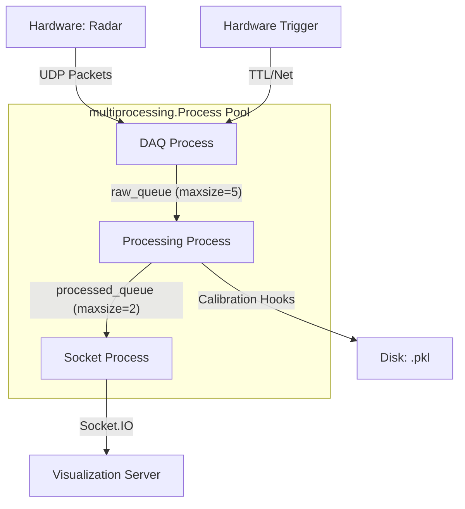

# Chirp Node: Under the Hood

This document provides a technical deep dive into the Chirp Node source code architecture, performance optimizations, and signal processing pipeline.

## 1. System Architecture

The Chirp Node operates on a **multi-process model** to ensure high-performance data acquisition and processing without being throttled by Python's Global Interpreter Lock (GIL).

### Process Breakdown (Defined in [main.py](file:///home/wni/Documents/School/ECE_Capstone/Chirp/Node/src/main.py))
1.  **DAQ Process (`daq_process`)**: Dedicated to sucking UDP packets off the wire as fast as possible. Pinned to CPU Core 0 using `psutil`.
2.  **Processing Process (`processing_process`)**: Executes the signal processing pipeline (RDM, CFAR, DBSCAN). Pinned to CPU Core 1.
3.  **Socket Process (`socket_process`)**: Handles networking and visualization data delivery. Pinned to CPU Core 2.

---

## 2. Inter-Process Communication (IPC)

The Chirp Node uses `multiprocessing.Queue` to safely pass data between specialized processes, ensuring zero-latency drops and decoupling hardware speeds from processing speeds.

### `raw_queue` (DAQ $\rightarrow$ Processing)
-   **Size**: `maxsize=5` (shallow but sufficient).
-   **Contents**: Raw `bytearray` radar frames directly from the socket.
-   **Rationale**: The DAQ process is strictly I/O bound. If the processing process (which is compute-bound) lags, the `raw_queue` serves as a high-speed buffer. If the queue fills up, DAQ will **drop** frames (`put_nowait`) to prioritize the *latest* data over backlogged history.

### `processed_queue` (Processing $\rightarrow$ Socket)
-   **Size**: `maxsize=2` (strict real-time).
-   **Contents**: Serialized Dictionary containing:
    -   `centroids`: Binary blob of 3D coordinates.
    -   `array`: Normalized heatmaps (RDM or Cluster view).
    -   `clusters`: Metadata objects for the UI (IDs, mass, angles).
-   **Rationale**: Visualization is secondary to processing. A very small queue size ensures that the visualization server only ever receives the "freshest" possible frame, minimizing glass-to-glass latency.

---

## 3. High-Performance Data Acquisition (DAQ)

Located in [radar/daq.py](file:///home/wni/Documents/School/ECE_Capstone/Chirp/Node/src/radar/daq.py), the DAQ layer is optimized for maximum throughput.

### The Nuclear Option: `capture()`
To handle the bursty nature of the radar's UDP stream (often >100Mbps), we use several extreme optimizations:
-   **`recvfrom_into`**: Uses zero-copy techniques to read directly into a pre-allocated `bytearray` buffer.
-   **Bit-Level Parsing**: Directly computes packet indices using bit shifts (`<< 8`, `|`) instead of slower Python `int` conversions.
-   **GC Control**: Garbage collection is explicitly **disabled** during the frame capture loop to prevent erratic timing spikes (micro-stutters).
-   **State Machine**: A custom reassembly state machine handles out-of-order or dropped UDP packets by mapping them into fixed memory slots based on the radar's byte count header.

---

## 4. Signal Processing Pipeline

The core logic resides in [radar/pipeline.py](file:///home/wni/Documents/School/ECE_Capstone/Chirp/Node/src/radar/pipeline.py) and the [radar/processing/](file:///home/wni/Documents/School/ECE_Capstone/Chirp/Node/src/radar/processing/) directory.

### Step 1: Range-Doppler Matrix (RDM)
-   **Module**: [rdm.py](file:///home/wni/Documents/School/ECE_Capstone/Chirp/Node/src/radar/processing/rdm.py)
-   **Deep Dive**: [rdm.md](file:///home/wni/Documents/School/ECE_Capstone/Chirp/Node/src/radar/processing/rdm.md)
-   Transforms raw IQ time-domain data into the Range-Doppler domain using a 2D FFT.
-   Applies a **Blackman window** to reduce side-lobes and improve dynamic range.

### Step 2: CFAR Detection
-   **Module**: [cfar.py](file:///home/wni/Documents/School/ECE_Capstone/Chirp/Node/src/radar/processing/cfar.py)
-   **Deep Dive**: [cfar.md](file:///home/wni/Documents/School/ECE_Capstone/Chirp/Node/src/radar/processing/cfar.md)
-   **Algorithm**: Cell-Averaging CFAR (CA-CFAR) using **Integral Images**.
-   **Details**:
    -   To maintain high FPS, we use a 2D integral image to compute the sum of training cells in $O(1)$ time per pixel, regardless of window size.
    -   The noise floor is estimated by taking the mean of a "Training Window" while excluding a central "Guard Window" to prevent signal leakage.
    -   **Optimization**: Fully vectorized in **PyTorch**. This allows the entire 2D RDM map to be processed in a single tensor operation. It automatically utilizes CUDA if a GPU is detected.

### Step 3: Angle Estimation (AoA)
-   **Module**: [angle.py](file:///home/wni/Documents/School/ECE_Capstone/Chirp/Node/src/radar/processing/angle.py)
-   **Deep Dive**: [angle.md](file:///home/wni/Documents/School/ECE_Capstone/Chirp/Node/src/radar/processing/angle.md)
-   **Algorithm**: FFT-based Beamforming on the Virtual Array.
-   **Details**:
    -   **Virtual Array**: For each detection point identified by CFAR, we extract the phase information across the virtual antenna array (built from the 3 TX and 4 RX antennas).
    -   **Super-Resolution**: We apply extreme zero-padding (e.g., up to 256 bins) to the virtual array data before performing an FFT. This interpolates the "sin-theta" space, providing much finer angular resolution than the physical antenna spacing would suggest.
    -   **Conversion**: The peak of the FFT is found in spatial frequency space and then mapped back to physical degrees using a `rad2deg(arcsin(...))` transformation.

### Step 4: 3D DBSCAN Clustering
-   **Module**: [clustering.py](file:///home/wni/Documents/School/ECE_Capstone/Chirp/Node/src/radar/processing/clustering.py)
-   **Deep Dive**: [clustering.md](file:///home/wni/Documents/School/ECE_Capstone/Chirp/Node/src/radar/processing/clustering.md)
-   **Algorithm**: Density-Based Spatial Clustering of Applications with Noise (DBSCAN) using **Mahalanobis Distance**.
-   **Details**:
    -   **Mahalanobis Metric**: Unlike standard Euclidean distance, we use a weighted covariance matrix (`MEASUREMENT_NOISE` from config). This accounts for the fact that radar measurement errors are different for Range (meters), Doppler (m/s), and Angle (degrees).
    -   **Coordinate Scaling**: Coordinates are normalized to balance the aspect ratio (e.g., a "small" change in angle shouldn't be outweighed by a "large" change in range).
    -   **GPU Acceleration**: The pairwise distance matrix and neighbor search are implemented using PyTorch tensor broadcasting, allowing us to cluster hundreds of points in milliseconds.

### Step 5: Centroiding & Mass Calculation
-   **Logic**: Processed in [clustering.py](file:///home/wni/Documents/School/ECE_Capstone/Chirp/Node/src/radar/processing/clustering.py).
-   Once clusters are identified, we calculate the **Centroid** (weighted center) and **Cluster Mass** (point count) for each object.

### Step 6: Multi-Target EKF Tracking [Optional / Inactive]
-   **Status**: Currently disabled in the main pipeline. 
-   **Module**: [tracking.py](file:///home/wni/Documents/School/ECE_Capstone/Chirp/Node/src/radar/processing/tracking.py)
-   **Deep Dive**: [tracking.md](file:///home/wni/Documents/School/ECE_Capstone/Chirp/Node/src/radar/processing/tracking.md)

---

## 5. Hardware Triggering & Calibration

For multi-node setups, the code in [hardware_trigger/](file:///home/wni/Documents/School/ECE_Capstone/Chirp/Node/src/hardware_trigger/) handles synchronization.
-   **Local Trigger**: Immediate pulse via GPIO.
-   **Networked Trigger**: Uses a master arbitrator to sync multiple nodes over the network, ensuring they capture frames at the exact same millisecond.
-   **Calibration**: The [CalibrationManager](file:///home/wni/Documents/School/ECE_Capstone/Chirp/Node/src/radar/calibration.py) handles the boresight and spatial offsets required to merge data from multiple radars into a single global coordinate system.

---

## 6. Configuration

All critical system parameters are centralized in [radar/config.py](file:///home/wni/Documents/School/ECE_Capstone/Chirp/Node/src/radar/config.py).
-   **`FAST_TIME` / `SLOW_TIME`**: Controls range and velocity resolution.
-   **`BYTES_IN_FRAME`**: Crucial for the DAQ reassembly logic.
-   **`MEASUREMENT_NOISE`**: Calibrated noise floor for the tracking algorithms.
