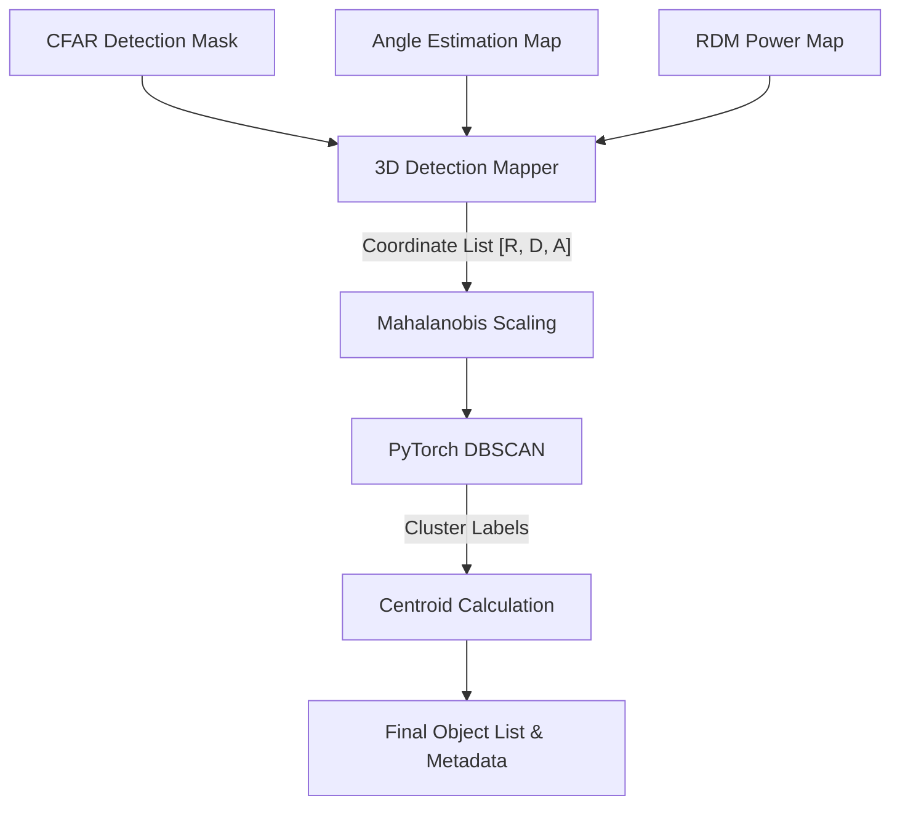

# 3D Clustering & Centroiding

The final step in the pipeline turns a "cloud" of hundreds of detection points into a set of distinct, tracked objects. We use **DBSCAN** for this.

## 1. Why Clustering?
CFAR detects every pixel that stands out from the noise. A single person might be represented by 20 or 30 different points in the RDM map (different range bins, different velocity bins, different angles). Clustering groups these related points into a single "object."

## 2. DBSCAN (Density-Based Spatial Clustering)
The radar uses **DBSCAN** because it doesn't require us to know how many objects are in the scene (unlike K-Means).
-   **Core Idea**: If a point has enough neighbors within a certain distance (`eps`), it's a "core point."
-   **Growth**: Clusters grow by connecting core points and their neighbors.
-   **Outliers**: Points that are far from everyone else are ignored as "noise."

## 3. Data Flow & Processing

The clustering process bridges the gap between raw signal detections and object tracking.

### Inputs
1.  **CFAR Detection Mask**: A boolean 2D array indicating which (Doppler, Range) bins contain valid detections.
2.  **Angle Estimation Map**: A 2D array providing the estimated azimuth angle (in radians) for every (Doppler, Range) bin.
3.  **RDM Power Map**: The absolute magnitude of the signal at each bin, used for power-weighting centroids.

## 4. Intermediate Steps

### 3D Detection Mapping (Spatial Cross-Referencing)
We first extract the indices of all detected points from the CFAR mask. In this context, an **index** acts as a "spatial pointer" that links the same physical point across three different data sources:
1.  **Selection**: The (Range, Doppler) index identifies a standout signal in the **CFAR Mask**.
2.  **Angle Retrieval**: We use that same index to "look up" the estimated Azimuth from the **Angle Estimation Map**.
3.  **Power Retrieval**: We use the index to retrieve the signal's magnitude from the **RDM Power Map** for mass calculation.

Each point is then converted into a 3D vector for the clustering algorithm:
$$ P = [ \text{Range Index}, \text{Doppler Index}, \text{Azimuth Angle} ] $$
This transforms the data from a dense grid into a sparse list of candidate "hits," while preserving the link to the original signal properties.

### Mahalanobis Distance (Weighted Distance)
Standard "distance" (Euclidean) is insufficient for radar because units are non-uniform:
-   A 1-meter range difference is small.
-   A 10-degree angle difference is HUGE.
-   A 0.5 m/s velocity difference is somewhere in between.

We use **Mahalanobis Distance**, which scales the 3-axis space using a **Measurement Noise Covariance Matrix** ($\Sigma$). 
$$ D_M(x, y) = \sqrt{(x-y)^T \Sigma^{-1} (x-y)} $$
This treats distance differently for each axis based on the radar's actual resolution and noise floor (configured via `SIGMA_RANGE`, `SIGMA_DOPPLER`, and `SIGMA_AZIMUTH`).

### PyTorch Implementation
To handle large point clouds in real-time, the distance matrix calculation is vectorized in PyTorch. The Mahalanobis inner product is computed using `torch.einsum`, allowing the entire batch of detection points to be processed simultaneously on the GPU or vectorized CPU.

## 5. Centroiding & Mass
Once a cluster is found, we calculate its key properties:
-   **Centroid**: The weighted "center" of the object. This is the coordinate sent to the tracking server.
-   **Cluster Mass**: The total number of points in the cluster.
    -   **High Mass**: Likely a large object (car, person).
    -   **Low Mass**: Likely a small object or a persistent noise spike.

## 6. Output
-   **Centroids Dictionary**: A map of `Cluster ID -> (Centroid Coordinate, Mass)`.
-   **2D Visualization Maps**: RDM-sized arrays where pixels are colored by their Cluster ID for debugging and UI display.
