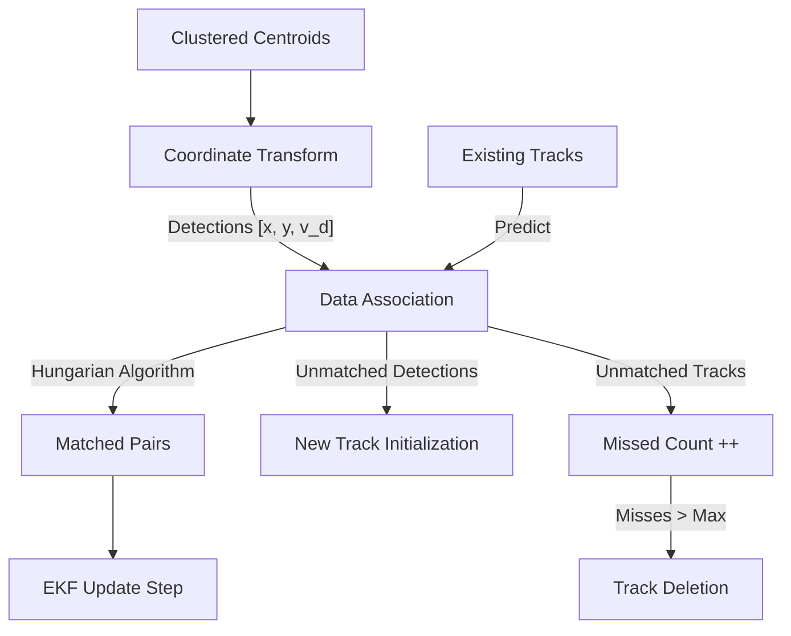

# Multi-Target EKF Tracking

The tracking module takes the discrete centroids from the clustering stage and turns them into persistent, "living" objects with history, unique IDs, and estimated trajectories.

## 1. Why Tracking?
Clustering provides the "where" for a single moment in time. Tracking provides:
- **Persistence**: Identifies that the object at time $t$ is the same as the object at $t+1$.
- **Smoothing**: Filters out jitter in range/angle measurements.
- **Velocity Estimation**: Calculates the true 2D velocity $(v_x, v_y)$ of the object.
- **Occlusion Handling**: Maintains a track even if the object is briefly missed for a few frames.

## 2. The Extended Kalman Filter (EKF)
We use an **Extended Kalman Filter** because the relationship between the object's state (Cartesian position) and the radar's measurement (Doppler velocity) is non-linear.

### State Vector ($x$)
The state represents the physical properties of the object in 2D Cartesian space:
$$ x = [p_x, p_y, v_x, v_y]^T $$
Where $p$ is position (meters) and $v$ is velocity (m/s).

### Process Model (Constant Velocity)
We assume objects move at a constant velocity between frames ($\Delta t$):
$$ F = \begin{bmatrix} 1 & 0 & \Delta t & 0 \\ 0 & 1 & 0 & \Delta t \\ 0 & 0 & 1 & 0 \\ 0 & 0 & 0 & 1 \end{bmatrix} $$
The prediction step is $x_{t+1} = F x_t$.

### Measurement Model ($h(x)$)
The radar provides three measurements: $[p_x, p_y, v_{doppler}]$.
While position is linear, the **Doppler Velocity** is the radial component of the true 2D velocity:
$$ v_{doppler} = \frac{p_x v_x + p_y v_y}{\sqrt{p_x^2 + p_y^2}} $$

### The Jacobian ($H$)
Because $v_{doppler}$ is non-linear, we must linearize it using a Jacobian matrix for the update step:
$$ H = \frac{\partial h(x)}{\partial x} = \begin{bmatrix} 1 & 0 & 0 & 0 \\ 0 & 1 & 0 & 0 \\ \frac{\partial v_{doppler}}{\partial p_x} & \frac{\partial v_{doppler}}{\partial p_y} & \frac{\partial v_{doppler}}{\partial v_x} & \frac{\partial v_{doppler}}{\partial v_y} \end{bmatrix} $$

## 3. Data Flow & Association

### Data Association (Hungarian Algorithm)
To match $N$ existing tracks to $M$ new detections, we use the **Hungarian Algorithm** (`linear_sum_assignment`).
1. **Cost Matrix**: We calculate the Euclidean distance between every track's predicted position and every new detection.
2. **Minimization**: The algorithm finds the assignment that minimizes the total distance.
3. **Gating**: If the best match distance exceeds a `dist_threshold`, we reject it and treat the detection as a new object.

## 4. Track Lifecycle
- **Birth**: Any unmatched detection that persists for `min_hits` frames becomes an active track.
- **Maintenance**: Every frame, the EKF predicts the next state and updates it with the best-matching detection.
- **Death**: If a track is not matched for `max_misses` (default 5) consecutive frames, it is deleted. This allows for brief signal fades without losing the object's identity.

## 5. Configuration & Tuning
Key parameters in `pipeline.py`:
- `dist_threshold`: Max distance (meters) to associate a detection with a track.
- `max_misses`: How many frames to "remember" a hidden object.
- `min_hits`: Minimum frames before a new detection is assigned a stable ID.
